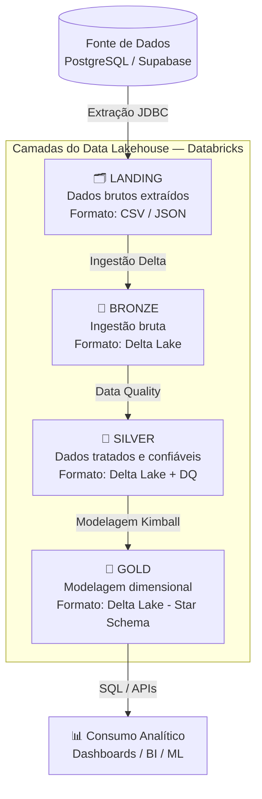

# 🏛️ Arquitetura Medalhão

## O que é a Arquitetura Medalhão?

A **Arquitetura Medalhão** (Medallion Architecture) é um padrão de design para organizar dados em um Data Lakehouse, popularizado pelo **Databricks**. Ela divide o armazenamento em camadas com níveis crescentes de qualidade e refinamento dos dados, representadas por metáforas de medalhas esportivas.



---

## Por que usar a Arquitetura Medalhão?

| Problema (sem Medalhão) | Solução (com Medalhão) |
|-------------------------|------------------------|
| Dados brutos misturados com dados processados | Separação clara por camada e qualidade |
| Sem rastreabilidade de transformações | Cada camada preserva o estado anterior |
| Reprocessamento total em caso de erro | Pode reprocessar a partir de qualquer camada |
| Sem controle de qualidade estruturado | Data Quality aplicado na transição Bronze → Silver |
| Difícil governança e auditoria | Delta Lake garante histórico e versionamento |

---

## As Quatro Camadas deste Projeto

### 📁 LANDING — Zona de Aterrissagem

A camada Landing é o **ponto de entrada** dos dados no ecossistema. Os dados chegam **exatamente como estão na fonte**, sem qualquer transformação.

!!! info "Características da camada LANDING"
    - **Formato:** CSV (dados relacionais do PostgreSQL)
    - **Modo de carga:** Full load (overwrite)
    - **Transformações:** Nenhuma — dados brutos
    - **Retenção:** Servem como "snapshot" da fonte

```
/Volumes/main/landing/dados/
├── regiao/
│   └── part-00000-*.csv
├── cliente/
│   └── part-00000-*.csv
├── sinistro/
│   └── part-00000-*.csv
└── ... (11 tabelas)
```

---

### 🥉 BRONZE — Ingestão Bruta (Delta Lake)

O Bronze transforma os CSVs do Landing em **tabelas Delta Lake**, adicionando metadados de ingestão e habilitando todas as capacidades do formato Delta.

!!! success "O que o Delta Lake habilita no BRONZE"
    - **ACID Transactions:** escritas atômicas, sem arquivos corrompidos
    - **Time Travel:** consulte qualquer versão anterior com `VERSION AS OF`
    - **Schema Enforcement:** rejeita dados com schema incompatível
    - **Audit Log:** `DESCRIBE HISTORY` mostra todas as operações

```python
# Exemplo de escrita no BRONZE com metadados
df = df.withColumn("_ingestao_timestamp", F.current_timestamp())
       .withColumn("_origem",             F.lit("landing/dados/sinistro"))
       .withColumn("_formato_origem",     F.lit("CSV"))

df.write.format("delta").mode("overwrite").saveAsTable("BRONZE.sinistro")
```

```sql
-- Time Travel no BRONZE
SELECT * FROM BRONZE.sinistro VERSION AS OF 0;

-- Histórico de versões
DESCRIBE HISTORY BRONZE.sinistro;
```

---

### 🥈 SILVER — Dados Tratados e Confiáveis

O Silver é a camada de **confiabilidade**. Dados com problemas de qualidade são corrigidos ou descartados. Esta camada é a "verdade única" (Single Source of Truth) para a organização.

!!! warning "Regras de Data Quality aplicadas"
    1. **Deduplicação** por chave primária
    2. **Nulos críticos** removidos (campos obrigatórios)
    3. **Strings padronizadas** (trim + capitalização)
    4. **CPF validado** (11 dígitos numéricos)
    5. **Datas consistentes** (`data_inicio < data_fim`)
    6. **Valores monetários** não negativos
    7. **Enumerações padronizadas** (lowercase)

```python
# Exemplo: validação de CPF no SILVER
df = df.filter(
    F.length(F.regexp_replace(F.col("cpf"), "[^0-9]", "")) == 11
)

# Exemplo: validação de datas em apólices
df = df.filter(F.col("data_inicio") < F.col("data_fim"))
```

---

### 🥇 GOLD — Modelagem Dimensional (Star Schema)

O Gold é a camada de **consumo analítico**. Os dados são reorganizados seguindo a metodologia **Ralph Kimball** em um **Star Schema**, otimizado para consultas de BI.

!!! tip "Por que Ralph Kimball?"
    A modelagem dimensional de Kimball organiza os dados em **tabelas Fato** (métricas) e **tabelas Dimensão** (contexto), resultando em consultas SQL simples e performáticas para análise de negócio.

```sql
-- Exemplo de consulta analítica no GOLD (Star Schema)
SELECT
    c.nome_cliente,
    c.estado,
    d.tipo_cobertura,
    t.ano,
    t.nome_mes,
    COUNT(f.sk_sinistro)      AS qtd_sinistros,
    SUM(f.valor_prejuizo)     AS total_prejuizo
FROM GOLD.FATO_SINISTROS f
JOIN GOLD.DIM_CLIENTE    c ON f.fk_cliente   = c.sk_cliente
JOIN GOLD.DIM_COBERTURA  d ON f.fk_cobertura = d.sk_cobertura
JOIN GOLD.DIM_TEMPO      t ON f.fk_tempo_ocorrencia = t.sk_tempo
GROUP BY c.nome_cliente, c.estado, d.tipo_cobertura, t.ano, t.nome_mes
ORDER BY total_prejuizo DESC;
```

---

## Tecnologias e Justificativas

### Por que Databricks?
O Databricks é a plataforma **PaaS** líder de mercado para Engenharia de Dados. A **Free Edition (Community)** oferece um cluster Spark gerenciado com suporte nativo a Delta Lake, Jobs & Pipelines — eliminando toda a complexidade de infraestrutura dos Trabalhos 1 e 2 (Docker, WSL, drivers JDBC manuais).

### Por que Supabase + PostgreSQL?
O Supabase oferece um banco PostgreSQL **totalmente gerenciado na nuvem**, acessível via JDBC diretamente do Databricks — sem problemas de conectividade de rede, firewall ou IP dinâmico.

### Por que Delta Lake?
Delta Lake é o formato padrão do Lakehouse moderno. Oferece ACID, Time Travel e Schema Enforcement sobre o armazenamento de objetos — transformando um simples Data Lake em um sistema confiável de dados.

---

## Referências

- [Medallion Architecture — Databricks](https://www.databricks.com/glossary/medallion-architecture)
- [Delta Lake Documentation](https://docs.delta.io/latest/index.html)
- [Building the Lakehouse — Databricks Blog](https://www.databricks.com/blog/2020/01/30/what-is-a-data-lakehouse.html)
- [The Data Warehouse Toolkit — Ralph Kimball](https://www.kimballgroup.com/data-warehouse-business-intelligence-resources/books/data-warehouse-dw-toolkit/)
