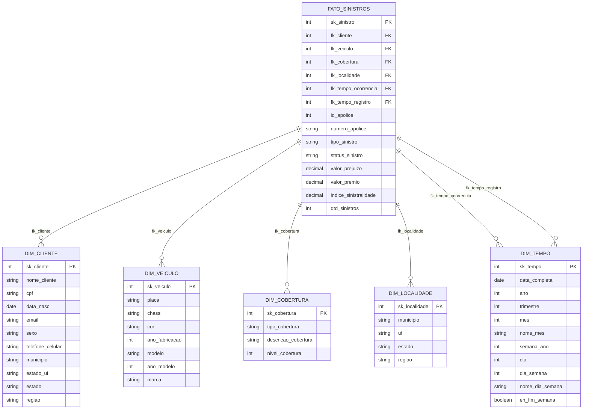

# 🥇 Modelagem Gold — Ralph Kimball (Star Schema)

A camada **GOLD** é o destino final do pipeline. Ela implementa a **Modelagem Dimensional** seguindo a metodologia de **Ralph Kimball**, organizando os dados em um **Star Schema** otimizado para análise e consumo por ferramentas de BI.

---

## O que é a Modelagem Dimensional?

A Modelagem Dimensional é uma técnica de design de banco de dados criada por **Ralph Kimball** nos anos 1990, amplamente adotada em Data Warehouses e Lakehouses modernos. Ela organiza os dados em dois tipos de tabelas:

| Tipo | Descrição | Exemplo neste projeto |
|------|-----------|----------------------|
| **Tabela Fato** | Contém as métricas (números) do negócio e as chaves para as dimensões | `FATO_SINISTROS` |
| **Tabela Dimensão** | Contém os atributos descritivos (contexto) | `DIM_CLIENTE`, `DIM_VEICULO`... |

### Por que usar Star Schema?

- **Consultas simples:** JOINs diretos entre fato e dimensões
- **Performance:** Menos JOINs que o modelo normalizado (3NF)
- **Legibilidade:** Analistas de negócio entendem a estrutura facilmente
- **Compatibilidade:** Todas as ferramentas de BI (Power BI, Tableau, Metabase) trabalham nativamente com Star Schema

---

## Diagrama — Star Schema do SeguroDB



---

## Tabelas Dimensão

### 👤 DIM_CLIENTE

Desnormaliza as informações do cliente junto com sua localização completa (endereço, município, estado, região). Elimina a necessidade de JOINs com tabelas de endereço nas consultas analíticas.

```sql
-- Exemplo de consulta usando DIM_CLIENTE
SELECT
    nome_cliente,
    estado,
    regiao,
    COUNT(*) AS total_sinistros
FROM GOLD.FATO_SINISTROS f
JOIN GOLD.DIM_CLIENTE c ON f.fk_cliente = c.sk_cliente
GROUP BY nome_cliente, estado, regiao
ORDER BY total_sinistros DESC;
```

**Chave:** `sk_cliente` (= `id_cliente` da Silver — surrogate key natural neste caso)

---

### 🚗 DIM_VEICULO

Combina carro, modelo e marca em uma única dimensão desnormalizada.

```sql
-- Sinistros por marca e modelo
SELECT
    v.marca,
    v.modelo,
    COUNT(*)           AS qtd_sinistros,
    SUM(valor_prejuizo) AS total_prejuizo
FROM GOLD.FATO_SINISTROS f
JOIN GOLD.DIM_VEICULO v ON f.fk_veiculo = v.sk_veiculo
GROUP BY v.marca, v.modelo
ORDER BY total_prejuizo DESC;
```

---

### 🛡️ DIM_COBERTURA

Dimensão de cobertura enriquecida com descrição textual e nível numérico ordenável.

| tipo_cobertura | nivel_cobertura | descricao_cobertura |
|----------------|-----------------|---------------------|
| basica | 1 | Cobre danos de terceiros e roubo parcial |
| intermediaria | 2 | Cobre danos próprios, roubo e responsabilidade civil |
| completa | 3 | Cobertura total incluindo fenômenos naturais e assistência 24h |

```sql
-- Sinistralidade por nível de cobertura
SELECT
    c.tipo_cobertura,
    c.nivel_cobertura,
    ROUND(AVG(f.indice_sinistralidade), 4) AS sinistralidade_media
FROM GOLD.FATO_SINISTROS f
JOIN GOLD.DIM_COBERTURA c ON f.fk_cobertura = c.sk_cobertura
GROUP BY c.tipo_cobertura, c.nivel_cobertura
ORDER BY c.nivel_cobertura;
```

---

### 📍 DIM_LOCALIDADE

Hierarquia geográfica completa: Município → Estado → Região.

```sql
-- Sinistros por região do Brasil
SELECT
    l.regiao,
    l.estado,
    COUNT(*) AS qtd_sinistros
FROM GOLD.FATO_SINISTROS f
JOIN GOLD.DIM_LOCALIDADE l ON f.fk_localidade = l.sk_localidade
GROUP BY l.regiao, l.estado
ORDER BY l.regiao, qtd_sinistros DESC;
```

---

### 📅 DIM_TEMPO

Calendário analítico gerado a partir das datas presentes nos dados. Permite análise por qualquer granularidade temporal sem cálculos na query.

```sql
-- Sazonalidade de sinistros por mês
SELECT
    t.ano,
    t.mes,
    t.nome_mes,
    t.eh_fim_semana,
    COUNT(f.sk_sinistro)   AS qtd_sinistros,
    SUM(f.valor_prejuizo)  AS total_prejuizo
FROM GOLD.FATO_SINISTROS f
JOIN GOLD.DIM_TEMPO t ON f.fk_tempo_ocorrencia = t.sk_tempo
GROUP BY t.ano, t.mes, t.nome_mes, t.eh_fim_semana
ORDER BY t.ano, t.mes;
```

!!! tip "Surrogate Key da DIM_TEMPO"
    A chave `sk_tempo` usa o formato `YYYYMMDD` (ex: `20250410`), o que permite ordenação
    numérica direta e JOIN eficiente sem conversão de tipo.

---

## Tabela Fato

### ⭐ FATO_SINISTROS

A tabela fato registra **cada sinistro** como uma linha, com métricas numéricas e referências (FK) para todas as dimensões.

#### Métricas disponíveis

| Métrica | Tipo | Descrição |
|---------|------|-----------|
| `valor_prejuizo` | DECIMAL | Valor do prejuízo declarado no sinistro |
| `valor_premio` | DECIMAL | Valor do prêmio da apólice associada |
| `indice_sinistralidade` | DECIMAL | `valor_prejuizo / valor_premio` — mede o risco |
| `qtd_sinistros` | INT | Sempre 1 — útil para SUM em agregações |

#### Exemplo de consulta completa (Star Schema)

```sql
-- Dashboard executivo: sinistros por cobertura, região e mês
SELECT
    t.ano,
    t.nome_mes,
    l.regiao,
    c.tipo_cobertura,
    COUNT(f.sk_sinistro)                  AS qtd_sinistros,
    SUM(f.valor_prejuizo)                 AS total_prejuizo,
    SUM(f.valor_premio)                   AS total_premios,
    ROUND(SUM(f.valor_prejuizo)
        / NULLIF(SUM(f.valor_premio), 0)
        * 100, 2)                         AS sinistralidade_pct
FROM GOLD.FATO_SINISTROS f
JOIN GOLD.DIM_TEMPO       t ON f.fk_tempo_ocorrencia = t.sk_tempo
JOIN GOLD.DIM_LOCALIDADE  l ON f.fk_localidade       = l.sk_localidade
JOIN GOLD.DIM_COBERTURA   c ON f.fk_cobertura        = c.sk_cobertura
GROUP BY t.ano, t.nome_mes, t.mes, l.regiao, c.tipo_cobertura
ORDER BY t.ano, t.mes, sinistralidade_pct DESC;
```

---

## Decisões de Design

### Surrogate Keys vs Natural Keys

Neste projeto usamos as PKs originais (`id_cliente`, `id_carro`...) como surrogate keys nas dimensões por simplicidade — dado que o volume é pequeno e não há histórico de SCD (Slowly Changing Dimensions).

Em produção, recomenda-se `monotonically_increasing_id()` ou sequências independentes para desacoplar as dimensões da fonte de dados.

### Desnormalização das Dimensões

As dimensões são propositalmente **desnormalizadas** (ex: DIM_CLIENTE contém município, estado e região em uma única tabela). Isso é a base do Star Schema: sacrifica algum espaço de armazenamento para ganhar performance de consulta e simplicidade.

### Índice de Sinistralidade

A métrica `indice_sinistralidade = valor_prejuizo / valor_premio` é um KPI real do setor de seguros. Valores acima de 1.0 indicam que o prejuízo supera o prêmio cobrado — sinal de risco elevado para a seguradora.

---

## Referências

- [The Data Warehouse Toolkit — Ralph Kimball & Margy Ross](https://www.kimballgroup.com/data-warehouse-business-intelligence-resources/books/data-warehouse-dw-toolkit/)
- [Dimensional Modeling Techniques — Kimball Group](https://www.kimballgroup.com/data-warehouse-business-intelligence-resources/kimball-techniques/dimensional-modeling-techniques/)
- [Star Schema vs Snowflake Schema — Databricks](https://www.databricks.com/glossary/star-schema)
- [Delta Lake — Star Schema Best Practices](https://docs.delta.io/latest/best-practices.html)
