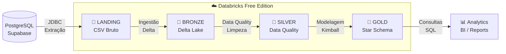

# 🏆 Trabalho 3 — Lakehouse com Databricks & Arquitetura Medalhão

  <strong>SATC — Engenharia de Software | 5ª Fase | Engenharia de Dados</strong> 
  <em>Acadêmico: Isaac Alexsander Pereira Pessoa | Professor: Jorge Luiz Silva</em>

---

## 🎯 Objetivo

Este projeto constrói um **pipeline de dados completo** na plataforma **Databricks Free Edition**, implementando a **Arquitetura Medalhão** sobre o domínio de **Seguro de Veículos**.

O pipeline extrai dados de um banco **PostgreSQL hospedado no Supabase** e os transporta através de quatro camadas de refinamento progressivo, culminando em um **Star Schema** pronto para análise (Ralph Kimball).

---

## 🏛️ Visão Geral da Arquitetura

---

## 📦 O que foi construído

=== "🔄 Pipeline"
    | Etapa | Notebook | Camada | Formato |
    |-------|----------|--------|---------|
    | 1 — Extração | `01_landing_extracao.py` | LANDING | CSV |
    | 2 — Ingestão | `02_bronze_ingestao.py` | BRONZE | Delta Lake |
    | 3 — Data Quality | `03_silver_data_quality.py` | SILVER | Delta Lake |
    | 4 — Modelagem | `04_gold_modelagem_dimensional.py` | GOLD | Delta Lake |

=== "🗃️ Dados"
    | Origem | 11 tabelas no Supabase (PostgreSQL) |
    |--------|--------------------------------------|
    | Domínio | Seguro de Veículos (SeguroDB) |
    | Clientes | 10 registros |
    | Apólices | 10 registros |
    | Sinistros | 10 registros |

=== "🥇 GOLD (Kimball)"
    | Tabela | Tipo |
    |--------|------|
    | `DIM_CLIENTE` | Dimensão |
    | `DIM_VEICULO` | Dimensão |
    | `DIM_COBERTURA` | Dimensão |
    | `DIM_LOCALIDADE` | Dimensão |
    | `DIM_TEMPO` | Dimensão |
    | `FATO_SINISTROS` | Fato ⭐ |

---

## ⚡ Destaques Técnicos

!!! success "Databricks PaaS — sem infraestrutura local"
    Toda a execução ocorre na nuvem. Não há Docker, WSL ou configuração de ambiente local.
    O Databricks gerencia o cluster Spark automaticamente.

!!! info "Delta Lake em todas as camadas Bronze, Silver e Gold"
    O formato Delta Lake garante **transações ACID**, **versionamento** (Time Travel) e
    **Schema Enforcement** em todas as camadas de dados processados.

!!! tip "Jobs & Pipelines — execução orquestrada"
    Os 4 notebooks são encadeados através de um **Databricks Job**, executando sequencialmente
    com dependências entre tarefas — exatamente como em ambientes de produção.

!!! note "Modelagem Dimensional Ralph Kimball"
    A camada Gold implementa um **Star Schema** com 5 dimensões e 1 tabela fato,
    pronta para consumo por ferramentas de BI.

---

## 🚀 Links Rápidos

- [📖 Arquitetura Medalhão](arquitetura.md) — Conceitos e decisões de design
- [⚙️ Configuração Databricks](databricks.md) — Passo a passo para reproduzir
- [🔄 Pipeline Detalhado](pipeline.md) — Cada camada explicada
- [🥇 Modelagem Gold](gold_kimball.md) — Star Schema Ralph Kimball
- [💻 Repositório GitHub](https://github.com/Isaac-Alexsander/trabalho3_databricks) — Código fonte

---

## 📚 Referências Principais

| Recurso | Link |
|---------|------|
| Databricks Free Edition | [community.cloud.databricks.com](https://community.cloud.databricks.com) |
| Delta Lake Docs | [docs.delta.io](https://docs.delta.io/latest/index.html) |
| Supabase Docs | [supabase.com/docs](https://supabase.com/docs) |
| Medallion Architecture | [databricks.com/glossary/medallion-architecture](https://www.databricks.com/glossary/medallion-architecture) |
| Canal DataWay BR | [youtube.com/@DataWayBR](https://www.youtube.com/@DataWayBR) |
| Repositório Base (Professor) | [spark-delta-minio-sqlserver](https://github.com/jlsilva01/spark-delta-minio-sqlserver) |
