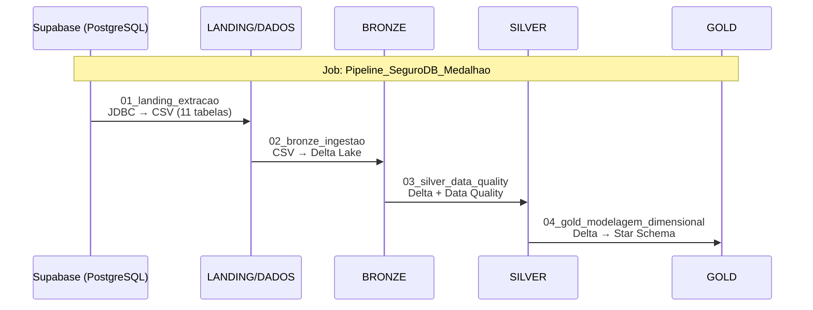
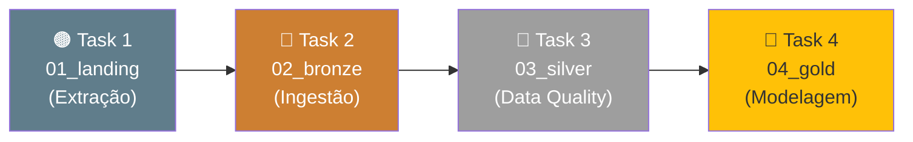

# 🔄 Pipeline Detalhado

Detalhamento técnico de cada etapa do pipeline, com código, lógica e decisões de implementação.

---

## Visão Geral do Fluxo



---

## Notebook 01 — Extração: Supabase → LANDING

**Arquivo:** `notebooks/01_landing_extracao.py`

### Objetivo
Conectar ao banco PostgreSQL do Supabase via **JDBC** e extrair todas as 11 tabelas do SeguroDB, gravando-as como arquivos **CSV** no volume `/Volumes/main/landing/dados/`.

### Configuração JDBC

```python
JDBC_URL = (
    f"jdbc:postgresql://{SUPABASE_HOST}:{SUPABASE_PORT}/{SUPABASE_DB}"
    f"?sslmode=require"  # SSL obrigatório no Supabase
)

df = (
    spark.read
    .format("jdbc")
    .option("url", JDBC_URL)
    .option("dbtable", f"public.{tabela}")
    .option("driver", "org.postgresql.Driver")
    .option("fetchsize", "10000")  # Lotes de 10k registros
    .load()
)
```

!!! info "Por que `fetchsize=10000`?"
    O parâmetro `fetchsize` controla quantos registros são buscados por vez do banco.
    O padrão (10) é muito lento para tabelas grandes. 10.000 reduz o round-trip de rede.

### Gravação no Landing

```python
(
    df.write
    .mode("overwrite")
    .option("header", "true")
    .option("delimiter", ",")
    .option("encoding", "UTF-8")
    .csv(f"/Volumes/main/landing/dados/{tabela}")
)
```

### Tabelas Extraídas

| # | Tabela | Colunas Principais |
|---|--------|--------------------|
| 1 | `regiao` | id_regiao, nome_regiao |
| 2 | `estado` | id_estado, nome_estado, uf, id_regiao |
| 3 | `municipio` | id_municipio, nome_municipio, id_estado |
| 4 | `marca` | id_marca, nome_marca |
| 5 | `modelo` | id_modelo, nome_modelo, id_marca, ano_modelo |
| 6 | `cliente` | id_cliente, nome, cpf, data_nasc, email, sexo |
| 7 | `endereco` | id_endereco, id_cliente, id_municipio, logradouro |
| 8 | `telefone` | id_telefone, id_cliente, ddd, numero, tipo |
| 9 | `carro` | id_carro, id_modelo, id_cliente, placa, chassi |
| 10 | `apolice` | id_apolice, numero_apolice, tipo_cobertura, valor_premio |
| 11 | `sinistro` | id_sinistro, id_apolice, tipo_sinistro, valor_prejuizo |

---

## Notebook 02 — Ingestão: LANDING → BRONZE

**Arquivo:** `notebooks/02_bronze_ingestao.py`

### Objetivo
Ler os CSVs do Landing e gravá-los no formato **Delta Lake** no schema `BRONZE`, adicionando metadados de ingestão.

### Leitura com inferência de schema

```python
df = (
    spark.read
    .option("header", "true")
    .option("inferSchema", "true")  # Detecta tipos automaticamente
    .option("encoding", "UTF-8")
    .csv(f"/Volumes/main/landing/dados/{tabela}")
)
```

### Enriquecimento com metadados

```python
df = (
    df
    .withColumn("_ingestao_timestamp", F.current_timestamp())
    .withColumn("_origem",             F.lit(f"landing/dados/{tabela}"))
    .withColumn("_formato_origem",     F.lit("CSV"))
)
```

!!! tip "Boas práticas — metadados de ingestão"
    As colunas prefixadas com `_` são convenção para indicar colunas técnicas, não de negócio.
    Elas permitem rastrear **quando** e **de onde** cada registro foi ingerido.

### Gravação em Delta Lake

```python
(
    df.write
    .format("delta")
    .mode("overwrite")
    .option("overwriteSchema", "true")
    .saveAsTable(f"BRONZE.{tabela}")
)
```

### Delta Lake — Time Travel

O Bronze habilita consultas históricas. Após a ingestão:

```sql
-- Consulta versão atual
SELECT * FROM BRONZE.sinistro;

-- Consulta versão inicial (carga 0)
SELECT * FROM BRONZE.sinistro VERSION AS OF 0;

-- Histórico completo
DESCRIBE HISTORY BRONZE.sinistro;
```

---

## Notebook 03 — Data Quality: BRONZE → SILVER

**Arquivo:** `notebooks/03_silver_data_quality.py`

### Objetivo
Aplicar **8 categorias de regras** de qualidade de dados, produzindo registros confiáveis na camada Silver.

### Regras e Implementações

=== "Deduplicação"
    ```python
    df = df.dropDuplicates(["id_cliente"])  # ou a PK da tabela
    ```

=== "Nulos Críticos"
    ```python
    df = df.dropna(subset=["id_cliente", "nome", "cpf", "data_nasc"])
    ```

=== "Padronização de Strings"
    ```python
    df = df.withColumn("nome", F.trim(F.col("nome")))
    df = df.withColumn("nome", F.initcap(F.col("nome")))
    ```

=== "Validação de CPF"
    ```python
    # Extrai apenas dígitos e valida comprimento = 11
    df = df.filter(
        F.length(F.regexp_replace(F.col("cpf"), "[^0-9]", "")) == 11
    )
    ```

=== "Validação de Datas"
    ```python
    # data_inicio deve ser anterior a data_fim
    df = df.filter(F.col("data_inicio") < F.col("data_fim"))
    ```

=== "Valores Monetários"
    ```python
    # Valor do prêmio deve ser positivo
    df = df.filter(F.col("valor_premio") > 0)
    
    # Prejuízo pode ser nulo, mas se existir, não pode ser negativo
    df = df.filter(
        F.col("valor_prejuizo").isNull() | (F.col("valor_prejuizo") >= 0)
    )
    ```

=== "Padronização Enums"
    ```python
    df = df.withColumn("status", F.lower(F.trim(F.col("status"))))
    df = df.withColumn("tipo_cobertura", F.lower(F.trim(F.col("tipo_cobertura"))))
    ```

=== "Metadados Silver"
    ```python
    df = df.withColumn("_silver_timestamp", F.current_timestamp())
             .withColumn("_silver_tabela",    F.lit(tabela))
    ```

### Relatório de qualidade

O notebook gera um relatório automático mostrando, por tabela:

| Coluna | Significado |
|--------|-------------|
| `registros_entrada` | Registros recebidos do Bronze |
| `registros_saida` | Registros aprovados na Silver |
| `registros_descartados` | Rejeitados por alguma regra DQ |

---

## Notebook 04 — Modelagem: SILVER → GOLD

**Arquivo:** `notebooks/04_gold_modelagem_dimensional.py`

### Objetivo
Aplicar a metodologia **Ralph Kimball** (Star Schema) sobre os dados tratados da Silver, criando 5 dimensões e 1 tabela fato.

Veja a [página dedicada à modelagem Gold](gold_kimball.md) para detalhes completos.

---

## Automação — Jobs & Pipelines

Os 4 notebooks são orquestrados pelo **Databricks Workflows** em um único Job com dependências sequenciais:



!!! success "Execução sequencial garantida"
    O Databricks Jobs garante que cada notebook só inicia após o anterior
    ser concluído **com sucesso**. Em caso de falha, o pipeline para e notifica.

---

## Referências

- [PySpark — DataFrame API](https://spark.apache.org/docs/latest/api/python/reference/pyspark.sql/dataframe.html)
- [Delta Lake — Quickstart](https://docs.delta.io/latest/quick-start.html)
- [Databricks — Ler CSV com Spark](https://docs.databricks.com/en/files/read-files.html)
- [Databricks — Delta Table Operations](https://docs.databricks.com/en/delta/index.html)
- [Databricks — Workflows / Jobs](https://docs.databricks.com/en/workflows/jobs/create-run-jobs.html)
